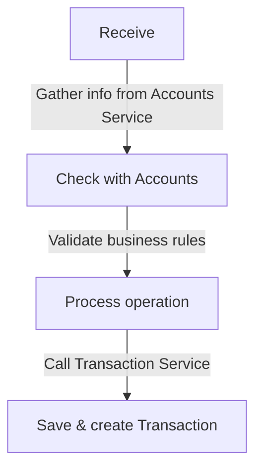

# Passive Operations

## Microservice for NttData's Bootcamp

This service has only two functions: to create a deposit, and to create a withdrawal.
Each of those operations have the following flow:

- Receive the information of the operation together with a request body.
- Call for the Accounts service to check balances and other information
- Process and save the operation
- Call the transaction service to create a new transaction

Stack:

- Spring Boot 2.7
- Java 11
- MongoDb for persistence
- OpenApi Generator, for API design
- Remote configuration (Spring Cloud Config with GitHub)
- Integrated Eureka client
- SonarQube for coverage with SpotBugs (FindBugs) & CheckStyle
- Various DTO

Current endpoints are:

- **POST /passive/deposits/{originAccountId}**: Creates a transaction given origin/destination accounts and other data.
- **POST /passive/withdrawals/{originAccountId}**: Returns the list of transactions for the given account.

### Design

The service uses DDD and Hexagonal architectures. The code is organized so that model package does not depend on
anything. I have used functional programing, streams, lambdas, etc.

### Compile and Deploy

To deploy, simply compile the project and run the generated jar. This service requires:

- That the config server ir running in the same host, with port 8888.
- That there is a Eureka server (Spring Cloud Netflix) running at the same host, port 8761.

### Copyright

All code has been written by me, Duberly Guarnizo <duberlygfr@gmail.com> and the use by external personal of NttData is
explicitly forbidden.
